Assignment 1 – Mobile applications

## Application architecture: 
The application architecture comprises two layers: the UI Layer and the Data Models. The UI Layer includes Chart, ChartBar, ExpensesList, ExpenseItem, ExpenseMenu, and Expenses. In the Data Models layer, we have Category and Expense, which underpin the core functionalities enabling users to categorize and organize their expenses effectively.

## User Story: 
As a user, I want to effortlessly track my expenses by entering titles, amounts, dates, and categories. I also want to view insightful charts showing my spending patterns, making financial management a breeze.

## Specifications: 
The specifications of the assignment can be found [here](https://docs.google.com/document/d/1NN_8vQoxLk_hnm8AVWTyfnkeDqMhBqonc5t1VH394lU/edit)

## Folder structure: 
In the app's folder structure, the 'lib' directory is the root, and 'main.dart' is the primary application file. Custom widgets are organized into separate files, including 'chart.dart,' 'chart_bar.dart,' 'expense_item.dart,' 'expenses-list.dart,' 'category_page.dart,' 'expenses.dart,' and 'new_expense.dart.'

## Class Diagram

```mermaid
classDiagram
    class Expense
    Expense : +id String
    Expense : +title String
    Expense : +amount double
    Expense : +date DateTime
    Expense : +category CategoryItem
    Expense o-- CategoryItem
    Expense : +formattedDate String


    class ExpenseBucket
    ExpenseBucket : +category CategoryItem
    ExpenseBucket o-- CategoryItem
    ExpenseBucket : +expenses List~Expense~
    ExpenseBucket : +totalExpenses double

    class CategoryPage
    CategoryPage : +onRemoveCategory void FunctionCategoryItem
    CategoryPage o-- void FunctionCategoryItem
    CategoryPage : +createState() State<CategoryPage>
    StatefulWidget <|-- CategoryPage

    class CategoryItem
    CategoryItem : +category String
    CategoryItem : +icon IconData
    CategoryItem o-- IconData

    class _CategoryPageState
    _CategoryPageState : -_icon Icon?
    _CategoryPageState o-- Icon
    _CategoryPageState : -_addNewCategory() void
    _CategoryPageState : -_pickIcon() dynamic
    _CategoryPageState : +build() Widget
    State <|-- _CategoryPageState

    class Chart
    Chart : +expenses List~Expense~
    Chart : +buckets List~ExpenseBucket~
    Chart : +maxTotalExpense double
    Chart : +build() Widget
    StatelessWidget <|-- Chart

    class ChartBar
    ChartBar : +fill double
    ChartBar : +build() Widget
    StatelessWidget <|-- ChartBar

    class Expenses
    Expenses : +createState() State<Expenses>
    StatefulWidget <|-- Expenses

    class _ExpensesState
    _ExpensesState : -_registeredExpenses List~Expense~
    _ExpensesState : -_openAddExpenseOverlay() void
    _ExpensesState : -_addExpense() void
    _ExpensesState : -_removeExpense() void
    _ExpensesState : +build() Widget
    State <|-- _ExpensesState

    class ExpensesList
    ExpensesList : +expenses List~Expense~
    ExpensesList : +onRemoveExpense void FunctionExpense
    ExpensesList o-- void FunctionExpense
    ExpensesList : +build() Widget
    StatelessWidget <|-- ExpensesList

    class ExpenseItem
    ExpenseItem : +expense Expense
    ExpenseItem o-- Expense
    ExpenseItem : +build() Widget
    StatelessWidget <|-- ExpenseItem

    class NewExpense
    NewExpense : +onAddExpense void FunctionExpense
    NewExpense o-- void FunctionExpense
    NewExpense : +createState() State<NewExpense>
    StatefulWidget <|-- NewExpense

    class _NewExpenseState
    _NewExpenseState : -_titleController TextEditingController
    _NewExpenseState o-- TextEditingController
    _NewExpenseState : -_amountController TextEditingController
    _NewExpenseState o-- TextEditingController
    _NewExpenseState : -_selectedDate DateTime?
    _NewExpenseState : -_selectedCategory CategoryItem
    _NewExpenseState o-- CategoryItem
    _NewExpenseState : -_presentDatePicker() void
    _NewExpenseState : -_removeCategory() void
    _NewExpenseState : -_submitExpenseData() void
    _NewExpenseState : +dispose() void
    _NewExpenseState : +build() Widget
    State <|-- _NewExpenseState
```

